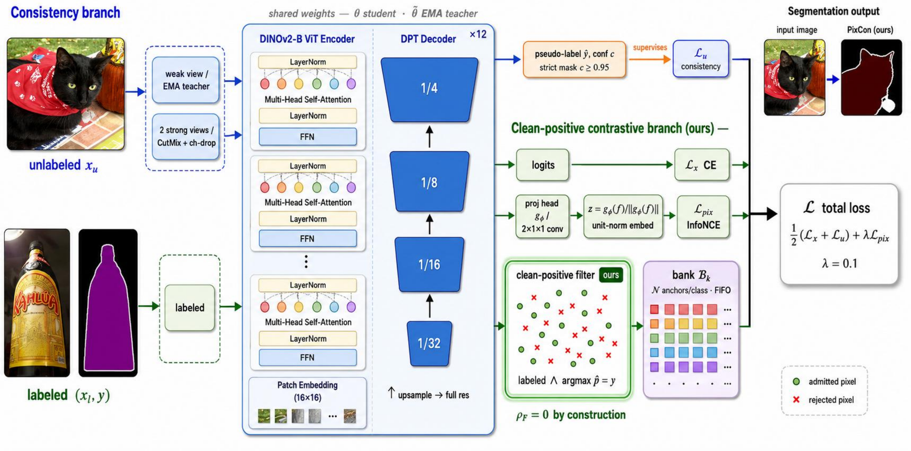
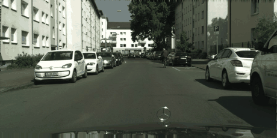
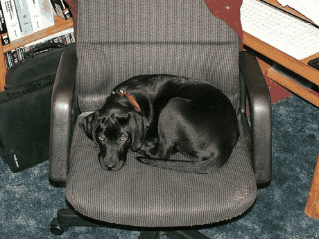

<div align="center">

# 🧩 PixCon

### Clean-Positive Contrastive Learning for Foundation-Model Semi-Supervised Segmentation

[](https://arxiv.org/abs/2607.03068)
[](https://psychofict.github.io/PixCon/)
[](https://huggingface.co/spaces/psychofict/pixcon-demo)
[](https://huggingface.co/psychofict/pixcon-pascal)
[](LICENSE)
[](https://www.python.org)
[](https://github.com/psychofict/PixCon/stargazers)

**[📄 Paper](https://arxiv.org/abs/2607.03068)** · **[🌐 Project page](https://psychofict.github.io/PixCon/)** · **[🤗 Live demo](https://huggingface.co/spaces/psychofict/pixcon-demo)** · **[⬇️ Weights](https://huggingface.co/psychofict/pixcon-pascal)**

*The bottleneck moved: at foundation-model strength, accuracy lives in how the embedding is structured by class, not in which pseudo-labels you filter.*





<sub>Before → after wipe (interactive slider on the <a href="https://psychofict.github.io/PixCon/">project page</a>).</sub>

</div>

## TL;DR

With a DINOv2 teacher, a strict confidence threshold already retains a *measured* ~98%-clean
pseudo-label set, so the accuracy that remains lives in how the embedding space is **structured by
class**, not in the filter. **PixCon** adds a single clean-positive pixel-contrastive branch on a
UniMatch V2 consistency backbone: a per-class memory bank that admits **only labeled pixels the
student already classifies correctly**, giving a contamination-free positive set (ρ_F = 0) *by
construction*.

- ✅ **No inference-time parameters** and **no bank-specific threshold** — a single switch over the backbone
- ✅ **Matches the strongest published SSSS result** (UniMatch V2-B) and **beats our compute-matched UniMatch V2 reproduction** on Pascal & ADE20K
- ✅ **Far above pre-foundation-model methods** (~9–18 mIoU) on all three benchmarks
- ✅ *Measured* pseudo-label contamination ρ_F = 0.018 (Pascal) / 0.106 (ADE20K), not assumed

## 🏆 Leaderboards (1/8 split, mIoU %)

<details open><summary><b>Pascal VOC</b></summary>

| Method | Backbone | mIoU |
|---|---|--:|
| UniMatch V2-B *(published)* | DINOv2-B | 87.9 |
| **PixCon (ours)** | **DINOv2-B** | **87.90** |
| UniMatch V2 *(our repro)* | DINOv2-B | 87.01 |
| SemiVL | CLIP-B | 85.6 |
| *— foundation ↑ / specialised ↓ —* | | |
| BeyondPixels | RN-101 | 78.6 |
| PrevMatch | RN-101 | 78.5 |
| AllSpark | MiT-B5 | 78.4 |
| UniMatch | RN-101 | 77.2 |
| AugSeg | RN-101 | 75.5 |
| PS-MT | RN-101 | 69.6 |

</details>

<details><summary><b>Cityscapes</b></summary>

| Method | Backbone | mIoU |
|---|---|--:|
| UniMatch V2-B *(published)* | DINOv2-B | 84.3 |
| UniMatch V2 *(our repro)* | DINOv2-B | 83.96 |
| **PixCon (ours)** | **DINOv2-B** | **83.88** |
| SemiVL | CLIP-B | 79.4 |
| *— foundation ↑ / specialised ↓ —* | | |
| BeyondPixels | RN-101 | 79.2 |
| CorrMatch | RN-101 | 78.5 |
| UniMatch | RN-101 | 77.9 |
| AugSeg | RN-101 | 77.8 |

</details>

<details><summary><b>ADE20K</b></summary>

| Method | Backbone | mIoU |
|---|---|--:|
| UniMatch V2-B *(published)* | DINOv2-B | 49.8 |
| **PixCon (ours)** | **DINOv2-B** | **49.23** |
| UniMatch V2 *(our repro)* | DINOv2-B | 49.10 |
| SemiVL | CLIP-B | 39.4 |
| *— foundation ↑ / specialised ↓ —* | | |
| UniMatch | CLIP-B | 38.0 |
| UniMatch | RN-101 | 34.6 |

</details>

PixCon and the "our repro" baseline differ by **exactly one switch** (the clean-positive branch), so
any margin is attributable to it. Pascal is a 3-seed mean; Cityscapes/ADE20K are single-seed.

## 🎬 More qualitative results

<div align="center">
<table>
<tr>
<td align="center"><br><sub><b>Pascal VOC</b> · 21 classes</sub></td>
<td align="center"><br><sub><b>ADE20K</b> · 150 classes</sub></td>
</tr>
</table>
</div>

## Method

| Component | Setting |
|---|---|
| Backbone | DINOv2-Base (ViT-B/14), fine-tuned end-to-end |
| Decoder | DPT-lite (4 ViT layers → coarse-to-fine pyramid) |
| Consistency | Two strong+CutMix views, complementary channel dropout (UniMatch V2) |
| Threshold | Fixed conf ≥ 0.95 |
| Auxiliary | **PixCon**: 1×1 projection head, per-class memory bank (256/class), clean-positive filter (labeled ∧ pred==GT), supervised InfoNCE (τ = 0.1) |
| Optimizer | AdamW, backbone LR 5e-6, decoder LR 2e-4, poly schedule |

The admission rule: a labeled pixel is stored as a positive **only if the student already predicts it
correctly** — so every stored positive is verifiably clean (ρ_F = 0). A first-order analysis of the
supervised-InfoNCE gradient shows the false-positive term scales as ρ_F/(1−ρ_F); we *measure* ρ_F
rather than assume it.

## Install

```bash
pip install -r requirements.txt
```

## Train

```bash
python train.py \
  --config configs/pascal.yaml \
  --data-root /path/to/pascal \
  --labeled-id-path splits/pascal/1_8/split_0/labeled.txt \
  --unlabeled-id-path splits/pascal/1_8/split_0/unlabeled.txt \
  --save-path exp/pascal/1_8/seed0 --seed 0

# UniMatch V2 baseline (no PixCon): add --no-pixcon
# Decomposition ablation: --pixcon-bank-filter {clean,labeled,conf}
```

Configs for `configs/{pascal,cityscapes,ade20k}.yaml`. Resume with `--resume <save_path>/latest.pth`.

## Inference

```python
import torch
from model.segmentor import PixConSegmentor
from core.inference import whole_inference

model = PixConSegmentor(backbone='dinov2_vitb14', nclass=21, pretrained=False).eval()
sd = torch.load('pixcon_pascal_1_8.pth', map_location='cpu')   # from the HF model repo
model.load_state_dict(sd, strict=False)                        # proj_head is inference-unused
```

**Pretrained weights:** [Pascal VOC](https://huggingface.co/psychofict/pixcon-pascal) ·
[Cityscapes](https://huggingface.co/psychofict/pixcon-cityscapes) ·
[ADE20K](https://huggingface.co/psychofict/pixcon-ade20k). Run the browser demo locally from
[`demo/`](demo) or online on [🤗 Spaces](https://huggingface.co/spaces/psychofict/pixcon-demo).

## Tests

```bash
python -m pytest tests/ -q   # CPU-only smoke tests
```

## Citation

```bibtex
@article{tarubinga2026pixcon,
  title   = {PixCon: Clean-Positive Contrastive Learning for Foundation-Model
             Semi-Supervised Segmentation},
  author  = {Tarubinga, Ebenezer},
  journal = {arXiv preprint arXiv:2607.03068},
  year    = {2026}
}
```

## License

[Apache-2.0](LICENSE). DINOv2 weights are loaded from `facebookresearch/dinov2` via `torch.hub`.

<div align="center"><sub>If PixCon is useful, please ⭐ the repo — it helps others find it.</sub></div>
